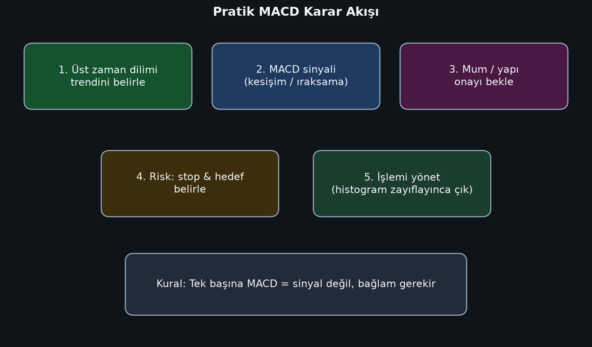
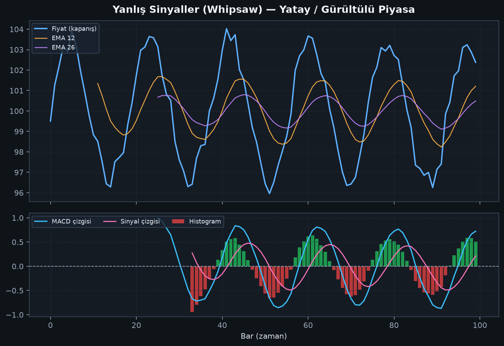

# MACD: Sıfırdan Ustaya Tam Rehber

> Görseller `gorseller/` klasöründedir. Bölüm dosyaları ayrı ayrı `bolumler/` altındadır.

---


---

# Bölüm 1 — MACD Nedir?

MACD, **Moving Average Convergence Divergence** ifadesinin kısaltmasıdır. Türkçede sıkça “hareketli ortalama yakınsama/uzaklaşma göstergesi” diye anılır.

Kısaca: MACD, fiyatın **kısa vadeli eğilimini** uzun vadeli eğilimle karşılaştırarak **momentum** ve **trend yönü** hakkında bilgi üretir.

## Ne işe yarar?

MACD şu sorulara cevap arar:

1. Kısa vadeli ortalama, uzun vadeli ortalamanın üstünde mi altında mı?
2. Momentum güçleniyor mu, zayıflıyor mu?
3. Trend devam mı ediyor, yoksa yorulma / dönüş ihtimali mi artıyor?

## Ne değildir?

- Saf bir “aşırı alım / aşırı satım” osilatörü değildir (RSI gibi sabit 0–100 skalası yoktur).
- Tek başına %100 doğru al-sat makinesi değildir.
- Geleceği bilmez; **geçmiş fiyatlardan türetilen gecikmeli (lagging)** bir göstergedir.

## Üç parçalı yapı

MACD ekranda genellikle üç parçayla görünür:

1. **MACD çizgisi** — ana momentum çizgisi  
2. **Sinyal çizgisi** — MACD’nin yumuşatılmış hali (tetik)  
3. **Histogram** — iki çizgi arasındaki fark (ivme)


## Convergence ve Divergence kelimeleri ne demek?

- **Convergence (yakınsama):** EMA12 ile EMA26 birbirine yaklaşır → momentum zayıflıyor olabilir.
- **Divergence (uzaklaşma):** İki EMA birbirinden uzaklaşır → momentum güçleniyor olabilir.

Ayrıca fiyat ile MACD’nin zıt hareket etmesine de “ıraksama / divergence” denir; bu ayrı bir sinyal türüdür (Bölüm 6).

## Hangi piyasalarda kullanılır?

MACD piyasa-bağımsızdır. Yeterince likit ve sürekliliği olan her seride kullanılabilir:

- Hisse senetleri
- Endeksler (ör. BIST 100)
- Döviz (Forex)
- Emtia (altın, petrol)
- Kripto varlıklar

Önemli olan varlık değil; **zaman dilimi**, **volatilite** ve **sinyali bağlama oturtma**dır.

## Bu bölümün özeti

MACD = iki EMA’nın farkından üretilen momentum/trend göstergesi.  
Üç bileşeni vardır: MACD çizgisi, sinyal çizgisi, histogram.  
Gecikmelidir; bağlam olmadan kullanılmamalıdır.


---

# Bölüm 2 — Tarihçe ve Standart Ayarlar

## Kim buldu?

MACD’yi **Gerald Appel** 1970’lerin sonlarında (genelde 1977 olarak anılır) geliştirdi. Amaç, fiyatın kısa ve uzun vadeli üstel ortalamaları arasındaki ilişkiyi tek bir momentum göstergesine indirmekti.

## Histogram kim ekledi?

Orijinal MACD’de asıl vurgu MACD ve sinyal çizgisindeydi. **Thomas Aspray** 1986’da **histogramı** popülerleştirerek kesişimlerin görsel olarak daha erken fark edilmesini sağladı. Bugün neredeyse tüm platformlarda histogram varsayılandır.

## Neden 12, 26, 9?

Standart ayar:

| Parametre | Değer | Anlamı |
|-----------|------:|--------|
| Hızlı EMA | 12 | Kısa vadeli ortalama |
| Yavaş EMA | 26 | Uzun vadeli ortalama |
| Sinyal EMA | 9 | MACD’nin tetik ortalaması |

Bu sayılar tarihsel olarak **günlük grafik** ve eski piyasa takvimine (haftalık işlem günleri) göre kalibre edilmiştir. Bugün “kutsal” değildir; ama **en çok kullanılan**, en çok test edilen ve en çok izlenen varsayılandır.

Bu yüzden:

- Yeni başlayanlar için varsayılan **12-26-9** ile başlamak doğru tercihtir.
- Herkese özel “sihirli ayar” aramak çoğu zaman overfitting (aşırı uyum) üretir.

## MACD lagging midir, leading midir?

Temelde **lagging**’dir çünkü hareketli ortalamalardan türetilir.  
Ancak:

- Histogramın daralması / yön değiştirmesi
- Iraksama (divergence)

gibi unsurlar, fiyat dönüşünden *önce* uyarı verebilir. Bu yüzden pratikte “gecikmeli çekirdek + erken uyarı katmanları” diye düşünmek daha doğrudur.

## Platformlarda nasıl eklenir?

Hemen her grafik platformunda `MACD` olarak bulunur. Varsayılan genelde `(12, 26, 9)` gelir. Kaynak veri olarak çoğu zaman **kapanış fiyatı** kullanılır.

## Bu bölümün özeti

Appel → MACD; Aspray → histogram.  
Standart ayar 12-26-9’dur.  
Varsayılanla ustalaşmadan ayar karıştırmayın.


---

# Bölüm 3 — Formül ve Adım Adım Hesaplama

## Temel formüller

\[
\text{MACD çizgisi} = EMA_{12}(Fiyat) - EMA_{26}(Fiyat)
\]

\[
\text{Sinyal çizgisi} = EMA_{9}(\text{MACD çizgisi})
\]

\[
\text{Histogram} = \text{MACD çizgisi} - \text{Sinyal çizgisi}
\]

## EMA nasıl hesaplanır?

Üstel hareketli ortalama (EMA), son fiyatlara daha fazla ağırlık verir.

\[
\alpha = \frac{2}{N+1}
\]

\[
EMA_t = \alpha \cdot Fiyat_t + (1-\alpha) \cdot EMA_{t-1}
\]

İlk EMA değeri için genelde ilk \(N\) barın **basit ortalaması (SMA)** kullanılır.

Örnek:

- EMA12 için \(\alpha = 2/13 \approx 0.1538\)
- EMA26 için \(\alpha = 2/27 \approx 0.0741\)
- Sinyal EMA9 için \(\alpha = 2/10 = 0.2\)

## Hesaplama akışı


Adımlar:

1. Kapanış serisini al
2. EMA12 ve EMA26’yı hesapla
3. MACD = EMA12 − EMA26
4. MACD üzerinde EMA9 al → sinyal
5. Histogram = MACD − sinyal

## Sayısal örnek (özet tablo)

Aşağıdaki tablo, sentetik bir fiyat serisinde standart (12,26,9) MACD’nin son 8 barını gösterir:


Tabloyu okuma:

- **MACD > 0** → EMA12, EMA26’nın üstünde (kısa vade daha güçlü)
- **Histogram > 0** → MACD, sinyalin üstünde (kısa vadeli tetik bullish)
- Histogram rengi değişiyorsa kesişim / ivme değişimi yakındır

## Python ile mini hesap (mantık)

```python
# sözde kod
ema12 = EMA(close, 12)
ema26 = EMA(close, 26)
macd_line = ema12 - ema26
signal = EMA(macd_line, 9)
histogram = macd_line - signal
```

Kitaptaki tüm grafikler `kitap/ornekler/macd_gorselleri_uret.py` ile üretilmiştir. Aynı script’i çalıştırarak görselleri yeniden üretebilirsiniz.

## Sık karıştırılan noktalar

1. **Sinyal çizgisi fiyata değil MACD’ye uygulanır.**  
2. Histogram ayrı bir “üçüncü ortalama” değildir; iki çizginin farkıdır.  
3. MACD’nin sıfır çizgisi, fiyatın sıfır olduğu anlamına gelmez; EMA12=EMA26 demektir.

## Bu bölümün özeti

MACD basit bir çıkarmadır: hızlı EMA − yavaş EMA.  
Sinyal, bu farkın EMA’sıdır.  
Histogram, farkın farkıdır (ivme).


---

# Bölüm 4 — Üç Bileşeni Derinlemesine

## 1) MACD çizgisi

MACD çizgisi göstergedeki “ana karakter”tir.

- **Pozitif:** EMA12 > EMA26 → kısa vadeli güç uzun vadeye üstün
- **Negatif:** EMA12 < EMA26 → kısa vadeli güç zayıf
- **Yükselen:** bullish momentum artıyor olabilir
- **Alçalan:** bearish momentum artıyor olabilir

MACD çizgisinin sıfırdan uzaklığı, iki EMA’nın birbirinden ne kadar ayrıldığını gösterir. Çok uzak = güçlü ayrışma (güçlü trend / aşırı uzama ihtimali).

## 2) Sinyal çizgisi

Sinyal çizgisi, MACD’nin 9 periyotluk EMA’sıdır. MACD’den daha yavaştır; bu yüzden:

- MACD yön değiştirince sinyal onu “kovalır”
- Kesişimler pratik tetik noktaları üretir

Sinyali “onay filtresi” gibi düşünün: ham MACD hareketini biraz yumuşatır.

## 3) Histogram

Histogram = MACD − Sinyal.

- Çubuklar **büyüyorsa** iki çizgi ayrışıyor → ivme artıyor
- Çubuklar **küçülüyorsa** iki çizgi yaklaşyor → ivme kaybı
- Histogram sıfırı geçmeden önce küçülmeye başlaması, kesişimin erken habercisi olabilir


## Birlikte okumak

Tek bileşene bakmak yetmez. En sağlıklı okuma:

| Soru | Nereye bak |
|------|------------|
| Trend bias nedir? | MACD’nin sıfırın üstü/altı |
| Tetik var mı? | MACD × sinyal kesişimi |
| Momentum hızlanıyor mu? | Histogram genişliyor mu? |
| Trend yoruluyor mu? | Histogram daralıyor mu / ıraksama var mı? |

## Yükseliş ve düşüş örnekleri


Yükselişte tipik tablo: MACD sıfır üstünde, sinyal kesişimleri bullish tarafta daha “temiz”, histogram pozitif bölgede genişleyebilir.


Düşüşte tipik tablo: MACD sıfır altında, bearish kesişimler öne çıkar.

## Bu bölümün özeti

MACD yönü, sinyal tetikleri, histogram ivmeyi anlatır.  
Üçünü birlikte okuyun; tek çizgiye bağlanmayın.


---

# Bölüm 5 — Temel Sinyaller

MACD’de üç ana sinyal ailesi vardır:

1. Sinyal çizgisi kesişimleri  
2. Sıfır çizgisi geçişleri  
3. Histogram okuması  

## 5.1 Sinyal çizgisi kesişimleri

### Bullish kesişim (al yönlü tetik)
MACD çizgisi, sinyal çizgisini **aşağıdan yukarı** keser.

### Bearish kesişim (sat yönlü tetik)
MACD çizgisi, sinyal çizgisini **yukarıdan aşağı** keser.


### Nasıl yorumlanır?

- Sıfır **üstünde** bullish kesişim → trend yönünde alım daha anlamlı olabilir  
- Sıfır **altında** bullish kesişim → çoğu zaman sadece düzeltme / zayıf tepki  
- Sıfır **altında** bearish kesişim → düşüş trendi teyidi daha güçlü olabilir  
- Sıfır **üstünde** bearish kesişim → kâr realizasyonu / düzeltme uyarısı olabilir  

> Kural: Aynı kesişim, sıfır çizgisinin neresinde olduğuna göre **farklı kalitededir**.

## 5.2 Sıfır çizgisi geçişleri

Sıfır çizgisi, EMA12 = EMA26 demektir. Bu geçiş daha seyrek ve daha yapısal bir sinyaldir.

- MACD **sıfırın üstüne** çıkar → kısa vade uzun vadenin üstüne geçmiş (bullish bias)
- MACD **sıfırın altına** iner → bearish bias


Sıfır geçişi genelde sinyal kesişiminden **daha geç** gelir ama trend değişiminin daha güçlü teyidi olabilir.

## 5.3 Histogram sinyalleri

Histogram, kesişimden önce “nefes” verir:

- Pozitif histogramın tepe yapıp küçülmesi → bullish momentum zayıflıyor
- Negatif histogramın dip yapıp toparlanması → bearish momentum zayıflıyor
- Histogramın sıfırdan geçmesi ≈ sinyal kesişimi anı

## 5.4 Sinyal kalitesi kontrolü

Bir kesişimi hemen işleme çevirmeden sorun:

1. Üst zaman dilimi trendi ne diyor?
2. Kesişim yatay piyasada mı, trend piyasasında mı?
3. Mum kapanışı teyit verdi mi?
4. Destek / direnç veya likidite bölgesi var mı?
5. Risk/ödül oranı mantıklı mı?

## Bu bölümün özeti

Kesişim = tetik, sıfır geçişi = bias, histogram = ivme.  
Kalite, konum ve bağlamla gelir.


---

# Bölüm 6 — Iraksama (Divergence)

Iraksama, **fiyat** ile **MACD**’nin uyumsuz hareket etmesidir. Momentumun fiyat kadar “inanmadığı” durumları işaret eder.

## 6.1 Düzenli (regular) ıraksama — dönüş uyarısı

### Bullish ıraksama
- Fiyat: **daha düşük dip** (Lower Low)
- MACD: **daha yüksek dip** (Higher Low)

Anlam: Satış baskısı fiyatı düşürüyor ama momentum zayıflıyor → yükseliş dönüşü ihtimali.


### Bearish ıraksama
- Fiyat: **daha yüksek tepe** (Higher High)
- MACD: **daha düşük tepe** (Lower High)

Anlam: Alım fiyatı yükseltiyor ama momentum zayıflıyor → düşüş dönüşü ihtimali.


## 6.2 Gizli (hidden) ıraksama — trend devamı

### Gizli bullish
- Fiyat: Higher Low
- MACD: Lower Low  
→ Yükseliş trendinde dip alımı / devam senaryosu


### Gizli bearish
- Fiyat: Lower High
- MACD: Higher High  
→ Düşüş trendinde tepeden satış / devam senaryosu

## 6.3 Iraksama kuralları (kritik)

1. **İki net swing** olsun. Belirsiz “küçük tırtıklar” ıraksama sayılmaz.  
2. Iraksama **uyarıdır**, emir değildir. Mum / yapı onayı bekleyin.  
3. Güçlü trendde düzenli ıraksama uzun süre “yanlış” kalabilir.  
4. Tercihen H1 ve üstü zaman dilimlerinde arayın.  
5. MACD aşırı bölgede (çok pozitif / çok negatif) oluşan ıraksamalar daha anlamlıdır.  
6. Mümkünse sinyal kesişimi ile teyit alın.

## 6.4 Hangi ıraksama daha “işe yarar”?

| Tür | Tipik kullanım | Risk |
|-----|----------------|------|
| Regular bullish/bearish | Dönüş aramak | Trende karşı işlem |
| Hidden bullish/bearish | Trend devamı | Yanlış devam sinyali |

Birçok deneyimli trader, **trend yönündeki gizli ıraksamayı**, trende karşı düzenli ıraksamadan daha “yüksek olasılıklı” bulur. Yine de tek başına garanti değildir.

## Bu bölümün özeti

Iraksama = fiyat ile momentumun anlaşmazlığı.  
Regular ≈ dönüş uyarısı, hidden ≈ devam uyarısı.  
Onaysız ıraksama işlem değildir.


---

# Bölüm 7 — Zaman Dilimi ve Ayar Seçimi

## 7.1 Varsayılan ne zaman yeter?

**12-26-9** şu işler için genelde yeterlidir:

- Günlük grafik swing trade
- 4H trend takibi
- Genel eğitim / öğrenme

Önce varsayılanı öğrenin. Ayar “optimize etmek”, çoğu zaman kayıpları gizlemek için yapılır.

## 7.2 Hızlı ve yavaş ayarlar


| Ayar | Karakter | Artı | Eksi |
|------|----------|------|------|
| 5-13-5 | Çok hızlı | Erken sinyal | Bol yanlış sinyal |
| 12-26-9 | Dengeli | Standart, izlenebilir | Orta gecikme |
| 19-39-9 | Yavaş | Gürültü filtreler | Geç giriş |

Aynı fiyat serisinde hızlı ayar daha çok kesişim üretir; yavaş ayar daha az ama daha “temiz” görünür.

## 7.3 Zaman dilimi matrisi

| Tarz | Tipik TF | MACD notu |
|------|----------|-----------|
| Scalp | M1–M15 | MACD genelde geç kalır; önerilmez |
| Intraday | M30–H1 | Dikkatli; üst TF filtresi şart |
| Swing | H4–D1 | MACD’nin doğal habitatı |
| Position | D1–W1 | Yavaş ayar veya standart |

Pratik kural: **H1 altını ana sinyal kaynağı yapmayın.**

## 7.4 Çoklu zaman dilimi (MTF) okuma

En sağlam yaklaşım:

1. Üst TF (ör. D1): MACD sıfır üstü/altı → bias  
2. İşlem TF (ör. H4): kesişim / ıraksama → setup  
3. Giriş TF (ör. H1): mum onayı → tetik  

Örnek: D1’de MACD sıfır üstünde iken H4 bullish kesişim, trende uyumlu alım aramak için daha kalitelidir.

## 7.5 Ayar değiştirme kararı

Ayar değiştirin **ancak**:

- Piyasa volatilitesi yapısal değiştiyse
- İşlem tarzınız (scalp vs swing) değiştiyse
- En az birkaç farklı dönemde ileri test (walk-forward) yaptıysanız

Ayar değiştirmeyin **eğer**:

- Son 3 işlem zarar ettiği için “suçlu arıyorsanız”
- Tek bir hisse/coinde backtest güzelleşsin diye oynuyorsanız

## Bu bölümün özeti

12-26-9 ile ustalaşın.  
Hızlı ayar = erken ama gürültülü; yavaş ayar = temiz ama geç.  
Üst zaman dilimi filtresi, ayar sihirinden daha değerlidir.


---

# Bölüm 8 — Stratejiler ve Karar Akışı

Bu bölüm “sinyali işleme çevirme” katmanıdır. Amaç ezber strateji değil; **tekrar edilebilir karar süreci** kurmaktır.

## 8.1 Temel karar akışı



1. Üst TF trend / bias  
2. MACD sinyali (kesişim, sıfır, ıraksama, histogram)  
3. Fiyat yapısı / mum onayı  
4. Risk: stop, hedef, pozisyon boyutu  
5. Yönetim: histogram zayıflayınca veya yapı bozulunca çık  

## 8.2 Strateji A — Trend yönünde sinyal kesişimi

**Mantık:** Trend varken momentum dönüşlerini yakalamak.

Kurallar (örnek):

- D1 MACD > 0 (bullish bias)
- H4’te MACD, sinyali yukarı keser
- Fiyat destek / yükselen yapıda
- Stop: son swing low altı
- Hedef: 1.5R–2R veya bir sonraki direnç
- Çıkış ek kuralı: histogram peş peşe küçülüp bearish kesişim gelirse

## 8.3 Strateji B — Sıfır çizgisi dönüşü

**Mantık:** Kısa/uzun EMA’nın yer değiştirmesini trend değişimi kabul etmek.

Kurallar:

- MACD sıfırın altına/üstüne net kapanışla geçer
- Hacim / kırılım mumları teyit eder
- Erken kesişimle değil, sıfır geçişi + retest ile girilir (daha geç, daha seçici)

## 8.4 Strateji C — Regular ıraksama + teyit

**Mantık:** Momentum zayıflamasını dönüşe çevirmek.

Kurallar:

- İki net swing ile regular ıraksama
- MACD aşırı bölgede
- Teyit: sinyal kesişimi veya reversal mum
- Trende karşı olduğu için daha küçük pozisyon / daha sıkı risk

## 8.5 Strateji D — Hidden ıraksama ile trend devamı

**Mantık:** Trend içi pullback’te devam aramak.

Kurallar:

- Ana trend net (ör. HH-HL yükseliş)
- Gizli bullish ıraksama
- Pullback sonlanırken bullish kesişim
- Stop pullback dibinin altı

## 8.6 Ne zaman işlem yok?

- Yatay, sıkı bant (whipsaw bölgesi)
- Önemli haber öncesi
- Üst TF ile alt TF tamamen çelişiyorsa
- Risk/ödül < 1
- Zaten aşırı uzamış hareketin ortasında “geç tren”

Whipsaw örneği:



Yatay piyasada MACD sürekli kesişim üretir. Bu, strateji değil gürültüdür.

## Bu bölümün özeti

Strateji = sinyal + bağlam + risk.  
En iyi MACD stratejisi, “her kesişimi almak” değil; “doğru ortamda seçmek”tir.


---

# Bölüm 9 — Diğer Göstergelerle Kombinasyon

MACD tek başına da kullanılabilir; ama filtrelerle kalite artar.

## 9.1 Fiyat yapısı (en önemli “gösterge”)

MACD’ten önce:

- Higher High / Higher Low mu?
- Lower High / Lower Low mu?
- Range mi?

MACD, yapıyla uyumluysa güçlenir; yapıyla çelişiyorsa zayıflar.

## 9.2 EMA / SMA trend filtresi

Örnek filtre:

- Fiyat 200 EMA üstünde + MACD bullish kesişim → long aday
- Fiyat 200 EMA altında + MACD bearish kesişim → short aday

Bu, trende karşı zayıf kesişimleri elemek için basittir.

## 9.3 RSI ile birlikte

| Durum | Yorum |
|------|------|
| MACD ıraksama + RSI ıraksama | Daha güçlü uyarı |
| MACD bullish ama RSI aşırı alım | Erken olabilir; teyit bekle |
| RSI nötr, MACD sıfır geçişi | Trend bias değişimi daha temiz olabilir |

RSI aşırı alım/satım için, MACD momentum/trend için daha doğaldır. Birbirinin kopyası değillerdir.

## 9.4 Hacim

- Bullish MACD kesişimi + artan hacim → teyit güçlenir
- Kesişim var ama hacim ölü → sahte kırılım riski

## 9.5 Destek / direnç ve likidite

MACD sinyali önemli seviyede doğarsa anlam kazanır:

- Destekten bullish kesişim
- Dirençten bearish kesişim
- Likidite süpürmesi sonrası ıraksama

Seviyesiz ortadaki kesişimler daha ucuzdur (daha değersiz).

## 9.6 Fazla gösterge tuzağı

5–6 osilatörü üst üste koymak “onay” değil, çoğu zaman **aynı bilginin tekrarıdır**.  
İyi set örneği:

1. Fiyat yapısı  
2. Bir trend filtresi (200 EMA veya üst TF MACD)  
3. MACD  
4. (Opsiyonel) hacim  

## Bu bölümün özeti

MACD’yi fiyat yapısı ve trend filtresiyle güçlendirin.  
Aynı işi yapan göstergeleri çoğaltmayın.


---

# Bölüm 10 — Hatalar, Tuzaklar ve Risk Yönetimi

## 10.1 En sık yapılan hatalar

1. **Her kesişimi almak**  
   Yatay piyasada MACD “al-sat makinesi” gibi görünür; gerçekte whipsaw üretir.

2. **Sinyal kesişimi ile sıfır geçişini karıştırmak**  
   Biri kısa vadeli tetik, diğeri yapısal bias’tır.

3. **Iraksamaya hemen girmek**  
   Iraksama uyarıdır. İkinci swing + onay şarttır.

4. **H1 altını ana sinyal yapmak**  
   Gecikme + gürültü = düşük kalite.

5. **Üst zaman dilimini yok saymak**  
   Düşüş trendinde her bullish kesişim “ucuz fırsat” değildir; çoğu tuzaktır.

6. **Ayarları zarar sonrası değiştirmek**  
   Strateji değil, duygusal overfitting’tir.

7. **Stop’suz işlem**  
   Gösterge ne kadar iyi olursa olsun risksiz değildir.

## 10.2 Risk yönetimi iskeleti

Her MACD setup’ında şu dört alan dolu olsun:

| Alan | Soru |
|------|------|
| Giriş | Neden şimdi? (sinyal + onay) |
| Stop | Nerede tez bozulur? |
| Hedef | Nereye kadar mantıklı? |
| Boyut | Bu stop ile hesabın yüzde kaçı risk? |

Pratik başlangıç:

- İşlem başına risk: hesabın %0.5–1’i
- Minimum R:R: 1.5
- Ardışık 3–4 zarar sonrası strateji değil, **süreç** gözden geçirilir

## 10.3 Çıkış disiplinleri

MACD’ye özel çıkış fikirleri:

- Histogram peş peşe küçülüyorsa trailing sıkılaştır
- Ters sinyal kesişimi gelirse kapat / küçült
- Sıfır çizgisine yaklaşırken trend işinde temkinli ol
- Hedefe gelince en az yarım pozisyon realize et

## 10.4 Psikoloji notu

MACD’nin en büyük tuzağı görsel netliğidir. Çizgiler kesişince beyin “işlem aç” der.  
İyi trader’ın farkı: **açmamayı** da sistemin parçası yapmasıdır.

## Bu bölümün özeti

MACD kaybettirmez; disiplinsiz kullanım kaybettirir.  
Stop, bağlam ve işlem seçiciliği olmadan gösterge işe yaramaz.


---

# Bölüm 11 — Pratik Kontrol Listesi

Her işlem öncesi bu listeyi geçin. Hepsi “evet” değilse işlem yok.

## A) Bağlam

- [ ] Üst zaman dilimi bias’ını yazdım (bull / bear / range)
- [ ] İşlem zaman dilimi üst bias ile çelişmiyor (veya bilerek karşı-trend + küçük risk)
- [ ] Piyasa aşırı haber / açılış kaosunda değil

## B) MACD sinyali

- [ ] Kullandığım sinyal türü net (kesişim / sıfır / ıraksama / histogram)
- [ ] Sinyal sıfır çizgisine göre konumunu değerlendirdim
- [ ] Histogram ivmeyi destekliyor veya en azından çelişmiyor

## C) Onay

- [ ] Fiyat yapısı (swing / seviye) ile uyumlu
- [ ] Mum kapanışı teyidi var
- [ ] (Varsa) hacim veya ikinci filtre destekliyor

## D) Risk

- [ ] Stop seviyesi objektif
- [ ] Hedef net veya kurala bağlı
- [ ] R:R ≥ 1.5
- [ ] Pozisyon boyutu hesaplandı
- [ ] Maksimum günlük zarar limitine takılmıyorum

## E) Yönetim planı

- [ ] Kısmi kâr alacağım yer belli
- [ ] Trailing / çıkış kuralı belli
- [ ] “Tez bozulursa ne yapacağım?” yazılı

## Günlük sonrası mini journal

1. Setup tipi neydi?  
2. Planı uyguladım mı?  
3. Hata duygusal mıydı, teknik miydi?  
4. Bir sonraki işlemde tek iyileştirme ne olacak?

## Kitabı bitirdikten sonra 7 günlük çalışma planı

| Gün | Görev |
|-----|-------|
| 1 | Demo grafikte sadece MACD çiz + bileşenleri ezberle |
| 2 | 20 sinyal kesişimini işaretle; hangileri whipsaw? |
| 3 | 10 regular ıraksama bul; kaçında onay geldi? |
| 4 | Aynı grafikte 5-13-5 vs 12-26-9 karşılaştır |
| 5 | Üst TF filtresi ile Strateji A’yı kâğıt trade et |
| 6 | Risk tablosu kur (stop, R, boyut) |
| 7 | Haftalık özet: en çok hangi hata tekrar etti? |

## Son söz

MACD’nin gücü karmaşık formülünde değil; **basitliği disiplinle kullanabilmenizdedir**.  
Çizgiler kesişir. Siz her seferinde kesişmek zorunda değilsiniz.


---

# Ek A — Sözlük

| Terim | Anlam |
|-------|-------|
| MACD | Moving Average Convergence Divergence |
| EMA | Exponential Moving Average (üstel hareketli ortalama) |
| SMA | Simple Moving Average (basit hareketli ortalama) |
| Sinyal çizgisi | MACD’nin EMA’sı; tetik çizgisi |
| Histogram | MACD − sinyal farkının çubuk gösterimi |
| Sıfır çizgisi | MACD = 0; EMA12 = EMA26 |
| Bullish kesişim | MACD’nin sinyali yukarı kesmesi |
| Bearish kesişim | MACD’nin sinyali aşağı kesmesi |
| Convergence | Ortalamaların birbirine yaklaşması |
| Divergence / ıraksama | Fiyat ile göstergenin uyumsuzluğu |
| Regular divergence | Dönüş uyarısı tipi ıraksama |
| Hidden divergence | Trend devamı tipi ıraksama |
| Lagging | Gecikmeli gösterge |
| Whipsaw | Yatay piyasada sık yanlış sinyal |
| Bias | Ana yön tercihi (bull/bear) |
| MTF | Multi-timeframe (çoklu zaman dilimi) |
| R:R | Risk/Reward (risk-getiri oranı) |
| Overfitting | Ayarları geçmişe aşırı uydurmak |


---

# Ek B — Formül Kartı (Tek Sayfa)

## Standart ayar
`(fast, slow, signal) = (12, 26, 9)`

## Formüller
```
α(N)        = 2 / (N + 1)
EMA_t       = α * fiyat_t + (1 - α) * EMA_(t-1)
MACD        = EMA(12) - EMA(26)
Sinyal      = EMA(9) of MACD
Histogram   = MACD - Sinyal
```

## Hızlı yorum
```
MACD > 0          → bullish bias
MACD < 0          → bearish bias
MACD × sinyal ↑   → bullish tetik
MACD × sinyal ↓   → bearish tetik
Histogram ↑       → ivme artışı
Histogram ↓       → ivme kaybı
```

## Iraksama kısa tablo
```
Regular bullish : fiyat LL + MACD HL
Regular bearish : fiyat HH + MACD LH
Hidden bullish  : fiyat HL + MACD LL
Hidden bearish  : fiyat LH + MACD HH
```

## 5 saniyelik kural
Üst TF bias + MACD sinyali + mum onayı + stop/hedef yoksa → işlem yok.


---

# Ek C — Kaynaklar ve İleri Okuma

Bu kitap, yaygın kabul görmüş teknik analiz kaynakları ve piyasa eğitim materyallerine dayanır.

## Temel referanslar

1. **Gerald Appel** — MACD’nin yaratıcısı; *Technical Analysis: Power Tools for Active Investors*  
2. **Thomas Aspray** — MACD histogramının popülerleşmesi (1986 dönemi çalışmaları)  
3. **Investopedia — MACD** — https://www.investopedia.com/terms/m/macd.asp  
4. **StockCharts ChartSchool — MACD** — https://school.stockcharts.com/doku.php?id=technical_indicators:moving_average_convergence_divergence_macd  
5. John J. Murphy — *Technical Analysis of the Financial Markets* (MACD bölümleri)

## Tamamlayıcı okumalar

- Sinyal vs sıfır çizgisi ayrımı ve mekanik tuzaklar üzerine pratik notlar (forex-basics / trader eğitim yazıları)
- Iraksama stratejilerinde onay ve zaman dilimi filtreleri (çeşitli academy / playbook içerikleri)

## Bu kitaptaki görseller

Tüm grafikler eğitim amaçlı **sentetik fiyat serileri** ile üretilmiştir. Gerçek bir hisse/forex çifti değildir; kavramı net göstermek için tasarlanmıştır.

Üretim script’i:

```bash
python3 kitap/ornekler/macd_gorselleri_uret.py
```

## Yasal / eğitim notu

Buradaki hiçbir şey yatırım tavsiyesi değildir. Kendi araştırmanızı yapın, risk yönetimini uygulayın, gerekirse profesyonel danışmanlık alın.

