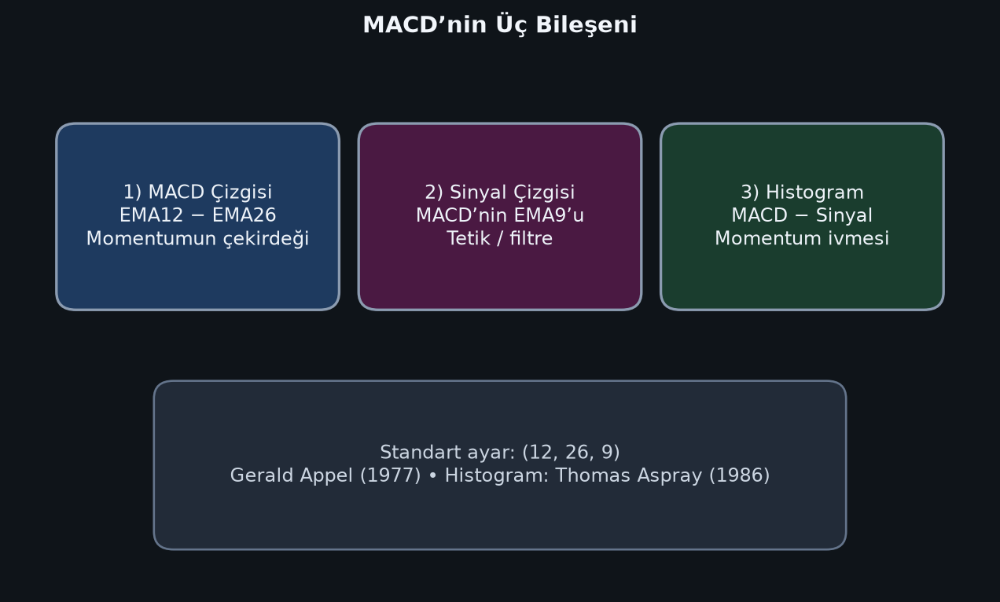

# Bölüm 1 — MACD Nedir?

MACD, **Moving Average Convergence Divergence** ifadesinin kısaltmasıdır. Türkçede sıkça “hareketli ortalama yakınsama/uzaklaşma göstergesi” diye anılır.

Kısaca: MACD, fiyatın **kısa vadeli eğilimini** uzun vadeli eğilimle karşılaştırarak **momentum** ve **trend yönü** hakkında bilgi üretir.

## Ne işe yarar?

MACD şu sorulara cevap arar:

1. Kısa vadeli ortalama, uzun vadeli ortalamanın üstünde mi altında mı?
2. Momentum güçleniyor mu, zayıflıyor mu?
3. Trend devam mı ediyor, yoksa yorulma / dönüş ihtimali mi artıyor?

## Ne değildir?

- Saf bir “aşırı alım / aşırı satım” osilatörü değildir (RSI gibi sabit 0–100 skalası yoktur).
- Tek başına %100 doğru al-sat makinesi değildir.
- Geleceği bilmez; **geçmiş fiyatlardan türetilen gecikmeli (lagging)** bir göstergedir.

## Üç parçalı yapı

MACD ekranda genellikle üç parçayla görünür:

1. **MACD çizgisi** — ana momentum çizgisi  
2. **Sinyal çizgisi** — MACD’nin yumuşatılmış hali (tetik)  
3. **Histogram** — iki çizgi arasındaki fark (ivme)

## Convergence ve Divergence kelimeleri ne demek?

- **Convergence (yakınsama):** EMA12 ile EMA26 birbirine yaklaşır → momentum zayıflıyor olabilir.
- **Divergence (uzaklaşma):** İki EMA birbirinden uzaklaşır → momentum güçleniyor olabilir.

Ayrıca fiyat ile MACD’nin zıt hareket etmesine de “ıraksama / divergence” denir; bu ayrı bir sinyal türüdür (Bölüm 6).

## Hangi piyasalarda kullanılır?

MACD piyasa-bağımsızdır. Yeterince likit ve sürekliliği olan her seride kullanılabilir:

- Hisse senetleri
- Endeksler (ör. BIST 100)
- Döviz (Forex)
- Emtia (altın, petrol)
- Kripto varlıklar

Önemli olan varlık değil; **zaman dilimi**, **volatilite** ve **sinyali bağlama oturtma**dır.

## Bu bölümün özeti

MACD = iki EMA’nın farkından üretilen momentum/trend göstergesi.  
Üç bileşeni vardır: MACD çizgisi, sinyal çizgisi, histogram.  
Gecikmelidir; bağlam olmadan kullanılmamalıdır.
