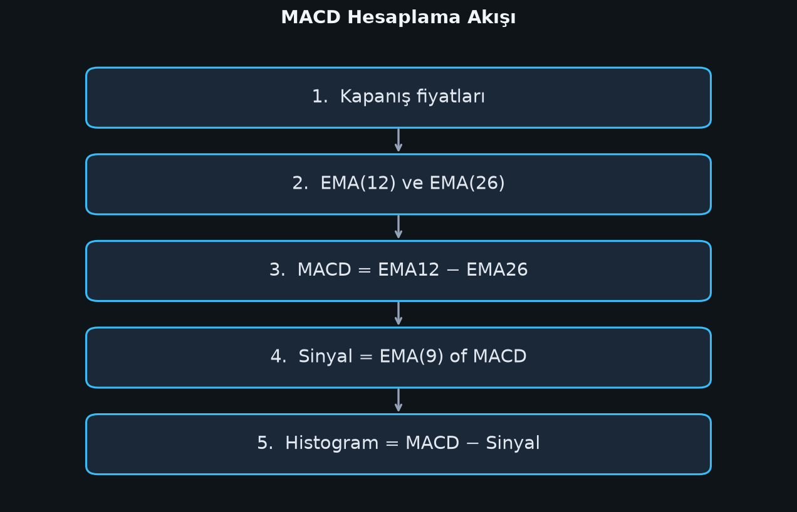
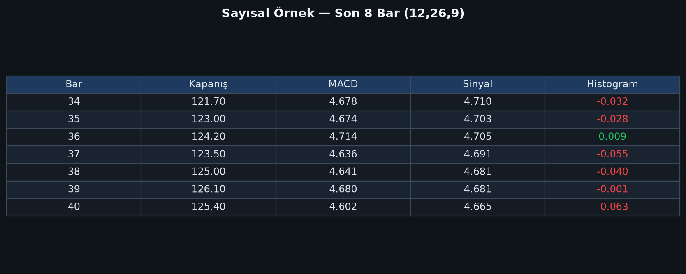

# Bölüm 3 — Formül ve Adım Adım Hesaplama

## Temel formüller

\[
\text{MACD çizgisi} = EMA_{12}(Fiyat) - EMA_{26}(Fiyat)
\]

\[
\text{Sinyal çizgisi} = EMA_{9}(\text{MACD çizgisi})
\]

\[
\text{Histogram} = \text{MACD çizgisi} - \text{Sinyal çizgisi}
\]

## EMA nasıl hesaplanır?

Üstel hareketli ortalama (EMA), son fiyatlara daha fazla ağırlık verir.

\[
\alpha = \frac{2}{N+1}
\]

\[
EMA_t = \alpha \cdot Fiyat_t + (1-\alpha) \cdot EMA_{t-1}
\]

İlk EMA değeri için genelde ilk \(N\) barın **basit ortalaması (SMA)** kullanılır.

Örnek:

- EMA12 için \(\alpha = 2/13 \approx 0.1538\)
- EMA26 için \(\alpha = 2/27 \approx 0.0741\)
- Sinyal EMA9 için \(\alpha = 2/10 = 0.2\)

## Hesaplama akışı



Adımlar:

1. Kapanış serisini al
2. EMA12 ve EMA26’yı hesapla
3. MACD = EMA12 − EMA26
4. MACD üzerinde EMA9 al → sinyal
5. Histogram = MACD − sinyal

## Sayısal örnek (özet tablo)

Aşağıdaki tablo, sentetik bir fiyat serisinde standart (12,26,9) MACD’nin son 8 barını gösterir:



Tabloyu okuma:

- **MACD > 0** → EMA12, EMA26’nın üstünde (kısa vade daha güçlü)
- **Histogram > 0** → MACD, sinyalin üstünde (kısa vadeli tetik bullish)
- Histogram rengi değişiyorsa kesişim / ivme değişimi yakındır

## Python ile mini hesap (mantık)

```python
# sözde kod
ema12 = EMA(close, 12)
ema26 = EMA(close, 26)
macd_line = ema12 - ema26
signal = EMA(macd_line, 9)
histogram = macd_line - signal
```

Kitaptaki tüm grafikler `kitap/ornekler/macd_gorselleri_uret.py` ile üretilmiştir. Aynı script’i çalıştırarak görselleri yeniden üretebilirsiniz.

## Sık karıştırılan noktalar

1. **Sinyal çizgisi fiyata değil MACD’ye uygulanır.**  
2. Histogram ayrı bir “üçüncü ortalama” değildir; iki çizginin farkıdır.  
3. MACD’nin sıfır çizgisi, fiyatın sıfır olduğu anlamına gelmez; EMA12=EMA26 demektir.

## Bu bölümün özeti

MACD basit bir çıkarmadır: hızlı EMA − yavaş EMA.  
Sinyal, bu farkın EMA’sıdır.  
Histogram, farkın farkıdır (ivme).
