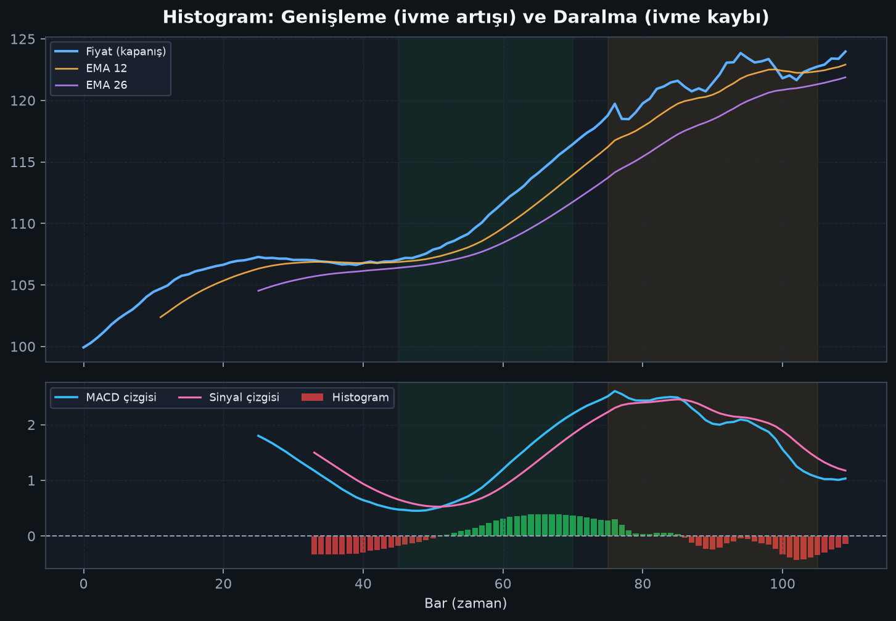
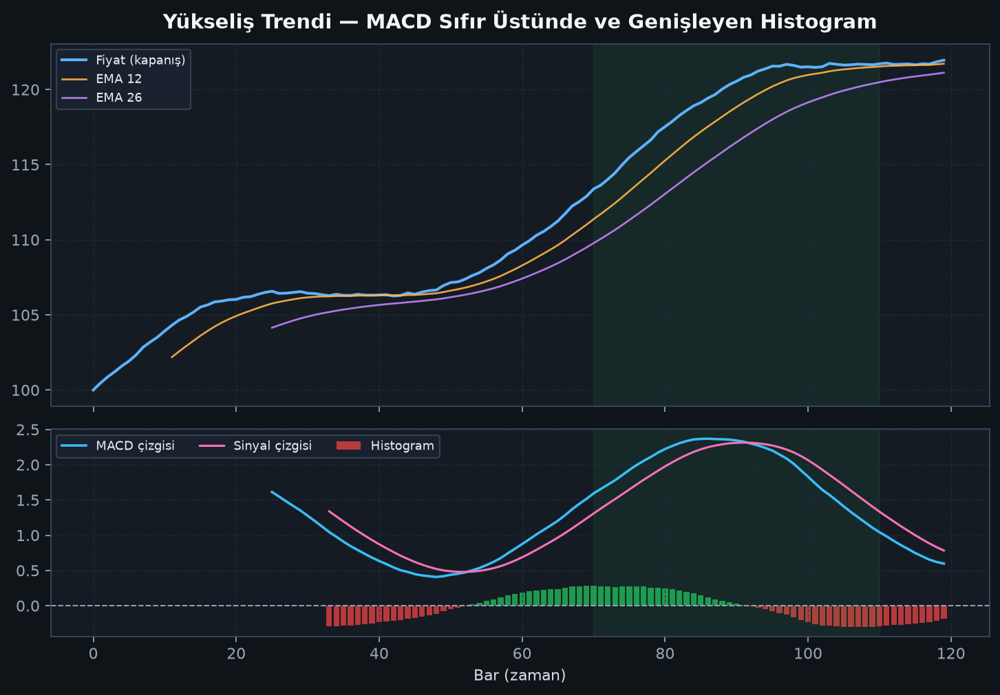
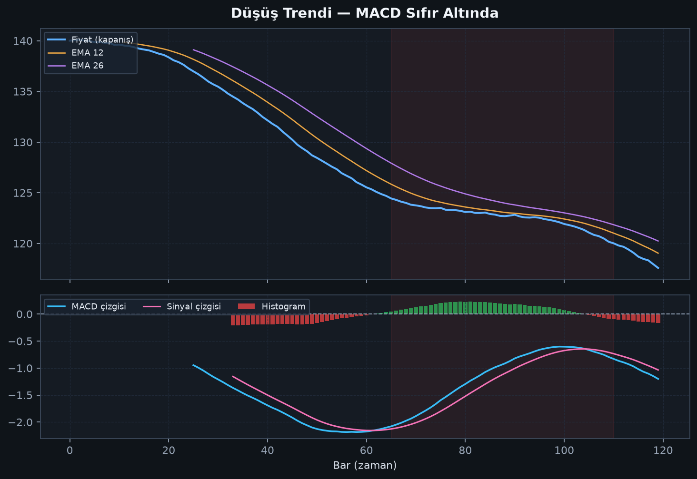

# Bölüm 4 — Üç Bileşeni Derinlemesine

## 1) MACD çizgisi

MACD çizgisi göstergedeki “ana karakter”tir.

- **Pozitif:** EMA12 > EMA26 → kısa vadeli güç uzun vadeye üstün
- **Negatif:** EMA12 < EMA26 → kısa vadeli güç zayıf
- **Yükselen:** bullish momentum artıyor olabilir
- **Alçalan:** bearish momentum artıyor olabilir

MACD çizgisinin sıfırdan uzaklığı, iki EMA’nın birbirinden ne kadar ayrıldığını gösterir. Çok uzak = güçlü ayrışma (güçlü trend / aşırı uzama ihtimali).

## 2) Sinyal çizgisi

Sinyal çizgisi, MACD’nin 9 periyotluk EMA’sıdır. MACD’den daha yavaştır; bu yüzden:

- MACD yön değiştirince sinyal onu “kovalır”
- Kesişimler pratik tetik noktaları üretir

Sinyali “onay filtresi” gibi düşünün: ham MACD hareketini biraz yumuşatır.

## 3) Histogram

Histogram = MACD − Sinyal.

- Çubuklar **büyüyorsa** iki çizgi ayrışıyor → ivme artıyor
- Çubuklar **küçülüyorsa** iki çizgi yaklaşyor → ivme kaybı
- Histogram sıfırı geçmeden önce küçülmeye başlaması, kesişimin erken habercisi olabilir

## Birlikte okumak

Tek bileşene bakmak yetmez. En sağlıklı okuma:

| Soru | Nereye bak |
|------|------------|
| Trend bias nedir? | MACD’nin sıfırın üstü/altı |
| Tetik var mı? | MACD × sinyal kesişimi |
| Momentum hızlanıyor mu? | Histogram genişliyor mu? |
| Trend yoruluyor mu? | Histogram daralıyor mu / ıraksama var mı? |

## Yükseliş ve düşüş örnekleri

Yükselişte tipik tablo: MACD sıfır üstünde, sinyal kesişimleri bullish tarafta daha “temiz”, histogram pozitif bölgede genişleyebilir.

Düşüşte tipik tablo: MACD sıfır altında, bearish kesişimler öne çıkar.

## Bu bölümün özeti

MACD yönü, sinyal tetikleri, histogram ivmeyi anlatır.  
Üçünü birlikte okuyun; tek çizgiye bağlanmayın.
