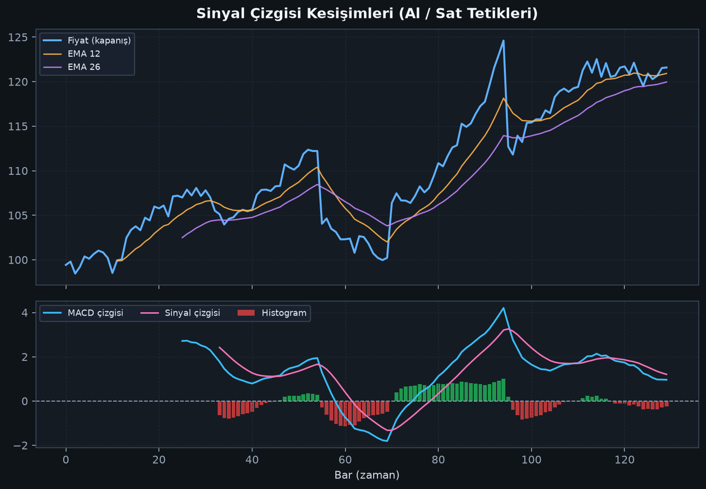
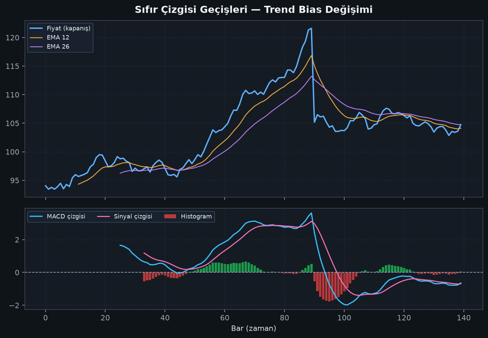

# Bölüm 5 — Temel Sinyaller

MACD’de üç ana sinyal ailesi vardır:

1. Sinyal çizgisi kesişimleri  
2. Sıfır çizgisi geçişleri  
3. Histogram okuması  

## 5.1 Sinyal çizgisi kesişimleri

### Bullish kesişim (al yönlü tetik)
MACD çizgisi, sinyal çizgisini **aşağıdan yukarı** keser.

### Bearish kesişim (sat yönlü tetik)
MACD çizgisi, sinyal çizgisini **yukarıdan aşağı** keser.

### Nasıl yorumlanır?

- Sıfır **üstünde** bullish kesişim → trend yönünde alım daha anlamlı olabilir  
- Sıfır **altında** bullish kesişim → çoğu zaman sadece düzeltme / zayıf tepki  
- Sıfır **altında** bearish kesişim → düşüş trendi teyidi daha güçlü olabilir  
- Sıfır **üstünde** bearish kesişim → kâr realizasyonu / düzeltme uyarısı olabilir  

> Kural: Aynı kesişim, sıfır çizgisinin neresinde olduğuna göre **farklı kalitededir**.

## 5.2 Sıfır çizgisi geçişleri

Sıfır çizgisi, EMA12 = EMA26 demektir. Bu geçiş daha seyrek ve daha yapısal bir sinyaldir.

- MACD **sıfırın üstüne** çıkar → kısa vade uzun vadenin üstüne geçmiş (bullish bias)
- MACD **sıfırın altına** iner → bearish bias

Sıfır geçişi genelde sinyal kesişiminden **daha geç** gelir ama trend değişiminin daha güçlü teyidi olabilir.

## 5.3 Histogram sinyalleri

Histogram, kesişimden önce “nefes” verir:

- Pozitif histogramın tepe yapıp küçülmesi → bullish momentum zayıflıyor
- Negatif histogramın dip yapıp toparlanması → bearish momentum zayıflıyor
- Histogramın sıfırdan geçmesi ≈ sinyal kesişimi anı

## 5.4 Sinyal kalitesi kontrolü

Bir kesişimi hemen işleme çevirmeden sorun:

1. Üst zaman dilimi trendi ne diyor?
2. Kesişim yatay piyasada mı, trend piyasasında mı?
3. Mum kapanışı teyit verdi mi?
4. Destek / direnç veya likidite bölgesi var mı?
5. Risk/ödül oranı mantıklı mı?

## Bu bölümün özeti

Kesişim = tetik, sıfır geçişi = bias, histogram = ivme.  
Kalite, konum ve bağlamla gelir.
