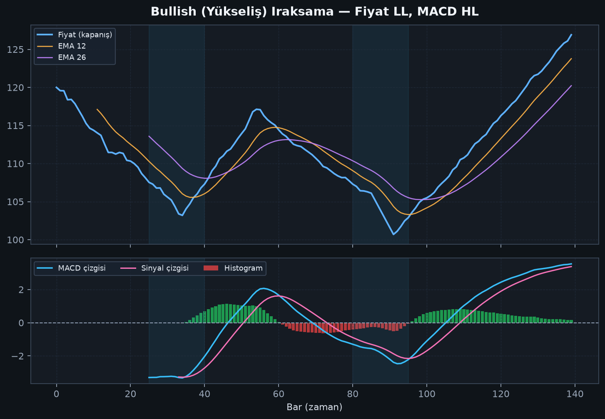
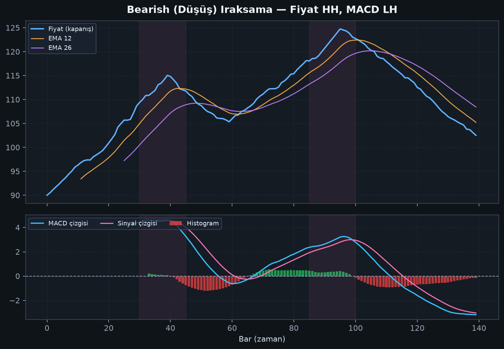
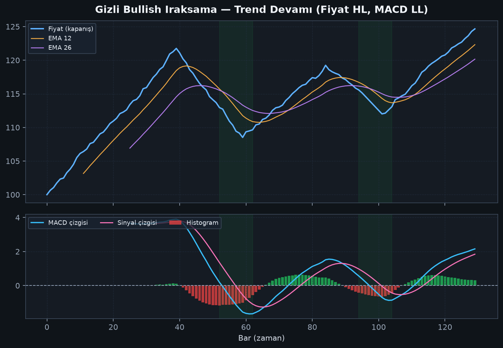

# Bölüm 6 — Iraksama (Divergence)

Iraksama, **fiyat** ile **MACD**’nin uyumsuz hareket etmesidir. Momentumun fiyat kadar “inanmadığı” durumları işaret eder.

## 6.1 Düzenli (regular) ıraksama — dönüş uyarısı

### Bullish ıraksama
- Fiyat: **daha düşük dip** (Lower Low)
- MACD: **daha yüksek dip** (Higher Low)

Anlam: Satış baskısı fiyatı düşürüyor ama momentum zayıflıyor → yükseliş dönüşü ihtimali.

### Bearish ıraksama
- Fiyat: **daha yüksek tepe** (Higher High)
- MACD: **daha düşük tepe** (Lower High)

Anlam: Alım fiyatı yükseltiyor ama momentum zayıflıyor → düşüş dönüşü ihtimali.

## 6.2 Gizli (hidden) ıraksama — trend devamı

### Gizli bullish
- Fiyat: Higher Low
- MACD: Lower Low  
→ Yükseliş trendinde dip alımı / devam senaryosu

### Gizli bearish
- Fiyat: Lower High
- MACD: Higher High  
→ Düşüş trendinde tepeden satış / devam senaryosu

## 6.3 Iraksama kuralları (kritik)

1. **İki net swing** olsun. Belirsiz “küçük tırtıklar” ıraksama sayılmaz.  
2. Iraksama **uyarıdır**, emir değildir. Mum / yapı onayı bekleyin.  
3. Güçlü trendde düzenli ıraksama uzun süre “yanlış” kalabilir.  
4. Tercihen H1 ve üstü zaman dilimlerinde arayın.  
5. MACD aşırı bölgede (çok pozitif / çok negatif) oluşan ıraksamalar daha anlamlıdır.  
6. Mümkünse sinyal kesişimi ile teyit alın.

## 6.4 Hangi ıraksama daha “işe yarar”?

| Tür | Tipik kullanım | Risk |
|-----|----------------|------|
| Regular bullish/bearish | Dönüş aramak | Trende karşı işlem |
| Hidden bullish/bearish | Trend devamı | Yanlış devam sinyali |

Birçok deneyimli trader, **trend yönündeki gizli ıraksamayı**, trende karşı düzenli ıraksamadan daha “yüksek olasılıklı” bulur. Yine de tek başına garanti değildir.

## Bu bölümün özeti

Iraksama = fiyat ile momentumun anlaşmazlığı.  
Regular ≈ dönüş uyarısı, hidden ≈ devam uyarısı.  
Onaysız ıraksama işlem değildir.
