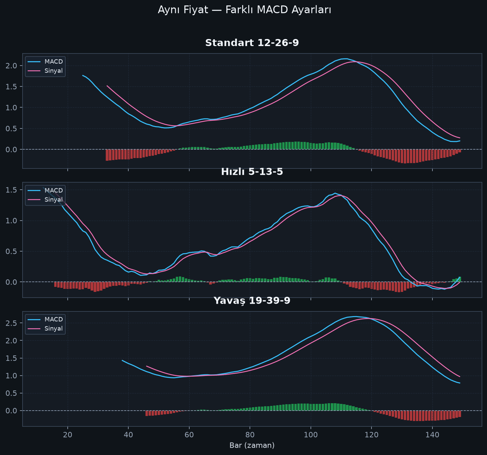

# Bölüm 7 — Zaman Dilimi ve Ayar Seçimi

## 7.1 Varsayılan ne zaman yeter?

**12-26-9** şu işler için genelde yeterlidir:

- Günlük grafik swing trade
- 4H trend takibi
- Genel eğitim / öğrenme

Önce varsayılanı öğrenin. Ayar “optimize etmek”, çoğu zaman kayıpları gizlemek için yapılır.

## 7.2 Hızlı ve yavaş ayarlar

| Ayar | Karakter | Artı | Eksi |
|------|----------|------|------|
| 5-13-5 | Çok hızlı | Erken sinyal | Bol yanlış sinyal |
| 12-26-9 | Dengeli | Standart, izlenebilir | Orta gecikme |
| 19-39-9 | Yavaş | Gürültü filtreler | Geç giriş |

Aynı fiyat serisinde hızlı ayar daha çok kesişim üretir; yavaş ayar daha az ama daha “temiz” görünür.

## 7.3 Zaman dilimi matrisi

| Tarz | Tipik TF | MACD notu |
|------|----------|-----------|
| Scalp | M1–M15 | MACD genelde geç kalır; önerilmez |
| Intraday | M30–H1 | Dikkatli; üst TF filtresi şart |
| Swing | H4–D1 | MACD’nin doğal habitatı |
| Position | D1–W1 | Yavaş ayar veya standart |

Pratik kural: **H1 altını ana sinyal kaynağı yapmayın.**

## 7.4 Çoklu zaman dilimi (MTF) okuma

En sağlam yaklaşım:

1. Üst TF (ör. D1): MACD sıfır üstü/altı → bias  
2. İşlem TF (ör. H4): kesişim / ıraksama → setup  
3. Giriş TF (ör. H1): mum onayı → tetik  

Örnek: D1’de MACD sıfır üstünde iken H4 bullish kesişim, trende uyumlu alım aramak için daha kalitelidir.

## 7.5 Ayar değiştirme kararı

Ayar değiştirin **ancak**:

- Piyasa volatilitesi yapısal değiştiyse
- İşlem tarzınız (scalp vs swing) değiştiyse
- En az birkaç farklı dönemde ileri test (walk-forward) yaptıysanız

Ayar değiştirmeyin **eğer**:

- Son 3 işlem zarar ettiği için “suçlu arıyorsanız”
- Tek bir hisse/coinde backtest güzelleşsin diye oynuyorsanız

## Bu bölümün özeti

12-26-9 ile ustalaşın.  
Hızlı ayar = erken ama gürültülü; yavaş ayar = temiz ama geç.  
Üst zaman dilimi filtresi, ayar sihirinden daha değerlidir.
